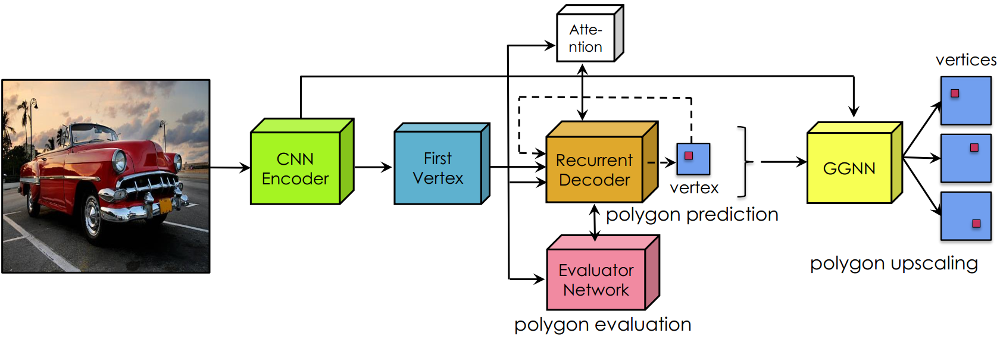
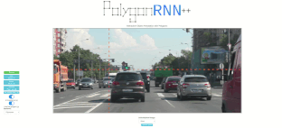
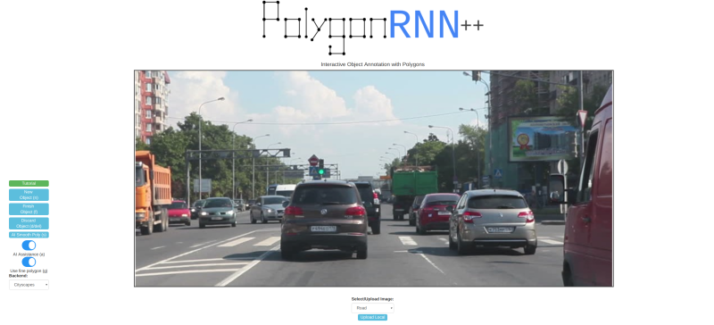

# PolygonRNN++

This is the official PyTorch reimplementation of Polygon-RNN++ (CVPR 2018). This repository allows you to train new Polygon-RNN++ models, and run our demo tool on local machines. For technical details, please refer to:

**Efficient Interactive Annotation of Segmentation Datasets with Polygon-RNN++**  
[David Acuna](http://www.cs.toronto.edu/~davidj/)\*, [Huan Ling](http:///www.cs.toronto.edu/~linghuan/)\*, [Amlan Kar](http://www.cs.toronto.edu/~amlan/)\*, [Sanja Fidler](http://www.cs.toronto.edu/~fidler/) (\* denotes equal contribution)   
CVPR 2018  
**[[Paper](https://arxiv.org/abs/1803.09693)] [[Video](https://www.youtube.com/watch?v=evGqMnL4P3E)] [[Project Page](http://www.cs.toronto.edu/polyrnn/)] [[Demo](https://goo.gl/forms/aWEHgFTyWfeA5oUt1)]**  



# Where is the code?
To get the code, please [signup](http://www.cs.toronto.edu/polyrnn/code_signup/) here. We will be using GitHub to keep track of issues with the code and to update on availability of newer versions (also available on website and through e-mail to signed up users).

If you use this code, please cite:

    @inproceedings{AcunaCVPR18,
    title={Efficient Interactive Annotation of Segmentation Datasets with Polygon-RNN++},
    author={David Acuna and Huan Ling and Amlan Kar and Sanja Fidler},
    booktitle={CVPR},
    year={2018}
    }

    @inproceedings{CastrejonCVPR17,
    title = {Annotating Object Instances with a Polygon-RNN},
    author = {Lluis Castrejon and Kaustav Kundu and Raquel Urtasun and Sanja Fidler},
    booktitle = {CVPR},
    year = {2017}
    }

# Contents
1. [Reproduction Results](#results)
2. [Environment Setup](#environment-setup)
3. [Tool](#tool)
    1. [Backend](#backend)
    2. [Frontend](#frontend)
4. [Testing Models](#testing-models)
5. [Training Models](#training-models)
    1. [Data](#data)
    2. [Training MLE Model](#training-mle-model)
    3. [Training RL Model](#training-rl-model)
    4. [Training Evaluator](#training-evaluator)
    5. [Training GGNN](#training-ggnn)

# Results
These are the reproduction results from this repository as compared to the paper

| Training Type | Num first points | LSTM Beam Size | Before | Now   |
|:-------------:|:----------------:|:--------------:|:------:|:-----:|
| MLE + Att     | 1                | 1              | 65.43  | 66.35 |
| MLE + Att + RL | 1               | 1              | 67.17  | 67.45 |
| MLE + Att + Evaluator | 5        | 1              | 69.72  | 71.05 |
| MLE + Att + Evaluator | 5        | 8              | 70.21  | 70.91 |
| MLE + Att + Evaluator + GGNN | 5 | 8              | 71.38  | 72.05 |
| MLE + Att + Evaluator + GGNN | 5 | 1              |   -    | 72.08 |
| MLE + Att + Evaluator + GGNN (Shared Encoder) | 5 | 8 | -  | 72.22 |
| MLE + Att + Evaluator + GGNN (Shared Encoder) | 5 | 1 | -  | **72.33** |

**Note:** Benchmarked forward pass speed for the tool (with 5 first points and 1 beam size) is 0.3 seconds per interaction on a TitanXp

**Note:** Shared Encoder refers to sharing the Resnet between the graph network and the convLSTM network. In the original paper, the two networks were kept separate.

# Environment Setup
All the code has been run and tested on Ubuntu 16.04, Python 2.7.12, Pytorch 0.4.0, CUDA 9.0, TITAN X/Xp and GTX 1080Ti GPUs

- Get code after [signing up](http://www.cs.toronto.edu/polyrnn/code_signup/)
- Go into the downloaded code directory
```
cd <path_to_downloaded_directory>
```
- Setup python environment
```
virtualenv env
source env/bin/activate
pip install -r requirements.txt
```
- Add the project to PYTHONPATH
```
export PYTHONPATH=$PWD
```

# Tool
- [Setup](#environment-setup) your environment
- Download the MLE+RL+Evaluator+GGNN model after getting access by [signing up](http://www.cs.toronto.edu/polyrnn/code_signup/)

## Backend
- Launch backend (flask server) with,
```
python Tool/tool.py --exp Experiments/tool.json --reload <path_to_model> --port <port> --image_dir Tool/frontend/static/img/
```

## Frontend
- Edit Tool/frontend/static/js/polygon.js and change globalFolder to the appropriate
directory based on where you cloned the repository.
- With python2.7, run
```
cd Tool/frontend/
python -m SimpleHTTPServer
```
- On your browser, navigate to localhost:8000. You should see a page like


**Note:** Replace SimpleHTTPServer with http.server if you are using python3 for the server

**Note:** You can setup your own image directory by editing Tool/frontend/static/js/polygon.js and passing that path to Tool/tool.py
from the command line. This image directory MUST contain the pre-defined images that are defined in Tool/frontend/index.html

# Testing Models
- [Setup](#environment-setup) your environment
- Download pretrained models after getting access by [signing up](http://www.cs.toronto.edu/polyrnn/code_signup/)

```
python Scripts/prediction/generate_annotation.py --exp <path_to_corresponding_experiment> --reload <path_to_checkpoint> --output_dir <path_to_store_predictions>
```
- You can check predicted/GT masks for every instance in the output_dir
- To get scores, run
```
python Scripts/get_scores.py --pred <path_to_preds> --output <path_to_file_to_save_results>
```

# Training Models

## Data 

### Cityscapes
- Download the Cityscapes dataset (leftImg8bit\_trainvaltest.zip) from the official [website](https://www.cityscapes-dataset.com/downloads/) [11 GB]
- Download our processed annotation files from [here](http://www.cs.toronto.edu/~amlan/data/polygon/cityscapes.tar.gz) [68 MB]
- From the root directory, run the following command with appropriate paths to get the annotation files ready for your machine
```
python Scripts/data/change_paths.py --city_dir <path_to_downloaded_leftImg8bit_folder> --json_dir <path_to_downloaded_annotation_file> --output_dir <output_dir>
```

### Custom Dataset
To train on your custom datasets, you have one of two options:
- Prepare annotation data similar to our annotation files and use our default DataProvider
- Implement your own DataProvider following the cityscapes implementation for your own data

## Training
- [Setup](#environment-setup) your environment
- Download the pre-trained Pytorch Resnet-50 from [here](https://download.pytorch.org/models/resnet50-19c8e357.pth)
- **Note** - While resuming training, always resume from end of epoch checkpoints to produce reproducible results!

### Training MLE model
- Edit the experiment file at [Experiments/mle.json](Experiments/mle.json) and change paths for your machine
- From the root directory, run
```
python Scripts/train/train_ce.py --exp Experiments/mle.json --reload <optional_if_resuming_training>
```
- You can view progress on Tensorboard (logs are at <experiment\_dir>/logs/)

### Training RL model
- Edit the experiment file at [Experiments/rl.json](Experiments/rl.json) and change paths for your machine
- In the experiment file, set xe\_initializer to the best MLE model
- From the root directory, run
```
python Scripts/train/train_rl.py --exp Experiments/mle.json --reload <optional_if_resuming_training>
```
- **Note** - You might have to play with hyperparameters a bit to achieve stable training, especially temperature, lr and lr\_decay

### Training Evaluator
- Edit the experiment file at [Experiments/evaluator.json](Experiments/evaluator.json) and change paths for your machine
- In the experiment file, set xe\_initializer to the best RL model
- From the root directory, run
```
python Scripts/train/train_evaluator.py --exp Experiments/evaluator.json --reload <optional_if_resuming_training>
```

### Training GGNN
- Edit the experiment file at [Experiments/ggnn.json](Experiments/ggnn.json) and change paths for your machine
- In the experiment file, set xe\_initializer to the best Evaluator model
- From the root directory, run
```
python Scripts/train/train_ggnn.py --exp Experiments/ggnn.json --reload <optional_if_resuming_training>
```
